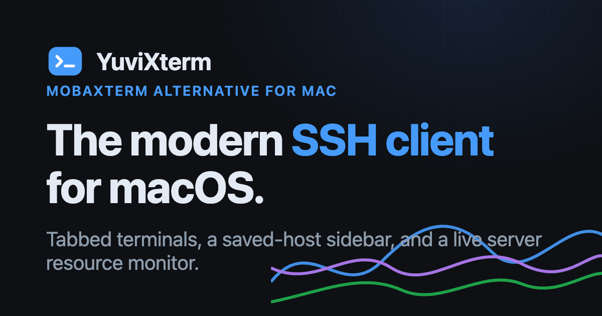
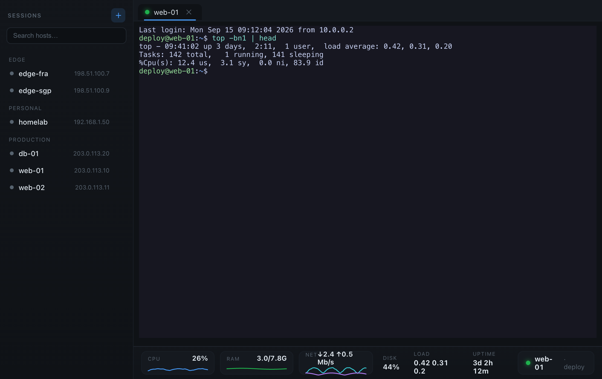
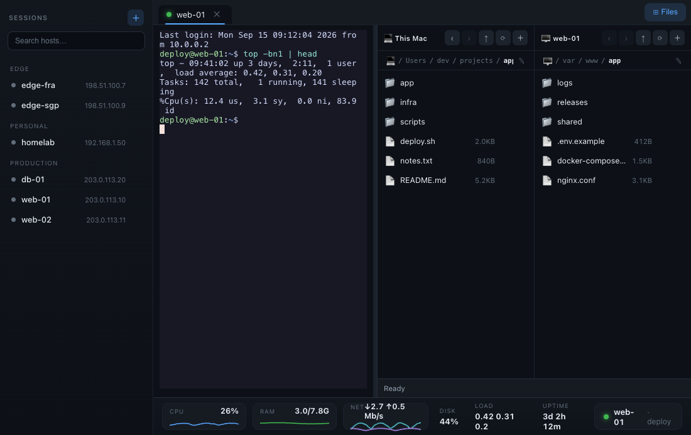

<div align="center">



# YuviXterm

**A modern, native SSH client for macOS and Windows — a free [MobaXterm](https://mobaxterm.mobatek.net/) alternative.**

Saved-host sidebar · tabbed terminals · a live server resource monitor · a dual-pane SFTP file browser.


### [⬇ Download for macOS](https://github.com/hobsRKM/yuvixterm/releases/latest) &nbsp;·&nbsp; [⬇ Download for Windows](https://github.com/hobsRKM/yuvixterm/releases/latest)



</div>

---

## What is YuviXterm?

MobaXterm never came to the Mac. **YuviXterm** brings the parts Mac users miss most — a saved-host sidebar, tabbed SSH terminals, a **live resource monitor** of every server you connect to, and a **dual-pane SFTP file browser** — into one clean, native app, on macOS and Windows. No account, no subscription.

## Features

- **Saved-host sidebar** — group and search across all your servers; one click to connect.
- **Tabbed terminals** — real [xterm.js](https://xtermjs.org) terminals with full color & resize; many live sessions at once.
- **Terminal your way** — right-click for copy · paste · select-all · clear, step the text size up or down (⌘/Ctrl +/−/0), and switch between four colour themes — Catppuccin, Dracula, Solarized Dark, Light. Your size & theme are remembered.
- **Live resource monitor** — a compact MobaXterm-style bottom bar graphs the *remote* box's CPU, RAM and network (Mb/s), with disk, load and uptime alongside. Hover the disk tile for **every mounted filesystem** — used / total / free per mount — live, over the same connection.
- **Dual-pane SFTP file browser** — move files between your machine and the server on the same connection: drag or double-click, with a live transfer bar, plus new-folder / rename / delete on both sides.
- **Encrypted credentials** — logins sealed in the OS's secure storage (macOS Keychain / Windows DPAPI), never plaintext; SSH keys, key passphrases & `ssh-agent` all supported.
- **Per-host advanced options** — custom key-exchange order, keepalive interval, pinned host-key fingerprints.
- **Trust-on-first-use host keys** — clear prompts for new hosts, and an explicit re-trust prompt if a key ever changes.

### Move files without leaving the app



## Download

All builds are on the **[Releases](https://github.com/hobsRKM/yuvixterm/releases/latest)** page:

| Platform | File | Notes |
|---|---|---|
| **macOS** 11 Big Sur or later | `YuviXterm-<version>-universal.dmg` | Universal — Apple Silicon + Intel |
| **Windows** 10 / 11 (64-bit) | `YuviXterm-Setup-<version>.exe` | Installer — per-user, no admin rights needed; adds Start Menu + desktop shortcuts |
| | `YuviXterm-Portable-<version>.exe` | Portable — no install, just run it |

> **First launch on macOS:** the build is independently distributed (unsigned), so right-click the app in Finder -> **Open** -> **Open**. macOS remembers it afterward.
>
> **First launch on Windows:** for the same reason, SmartScreen may show "Windows protected your PC" -> **More info** -> **Run anyway**.

## Build from source

```bash
git clone https://github.com/hobsRKM/yuvixterm.git
cd yuvixterm
npm install
npm start        # run in dev
npm test         # unit tests (node --test)
npm run dist     # package for your current OS -> dist/
                 #   on macOS   -> YuviXterm-<version>-universal.dmg
                 #   on Windows -> YuviXterm-Setup-<version>.exe (+ a portable .exe)
npm run icons:win  # (optional) regenerate the Windows icon + installer art from website/favicon.svg
```

## How it works

| Layer | Tech |
|---|---|
| App shell | **Electron** — contextIsolation on, nodeIntegration off, sandboxed renderer |
| SSH transport | [**ssh2**](https://github.com/mscdex/ssh2) — auth, the shell channel, the /proc monitor feed, and the SFTP file browser |
| Terminal | [**xterm.js**](https://xtermjs.org) |

The renderer talks to the main process only through a typed `window.api` bridge. Logins are encrypted with Electron `safeStorage` (macOS Keychain / Windows DPAPI) and stored with owner-only permissions; a Content-Security-Policy blocks all remote content, so your hosts and secrets never leave your machine. The bug-prone pure logic (the /proc stats parser, the encrypted session store, the connect-config builder, the host-key verifier, and the file-path helpers) is unit-tested (`npm test`).

## Roadmap

Included: tabbed terminals (copy/paste, zoom, colour themes), live monitor with per-mount disk detail, SFTP file browser (single files). Not yet: recursive folder transfer, `chmod`/permissions, X11, and port forwarding.

## License

[MIT](LICENSE) (c) 2026 Yuvaraj Mudaliar
